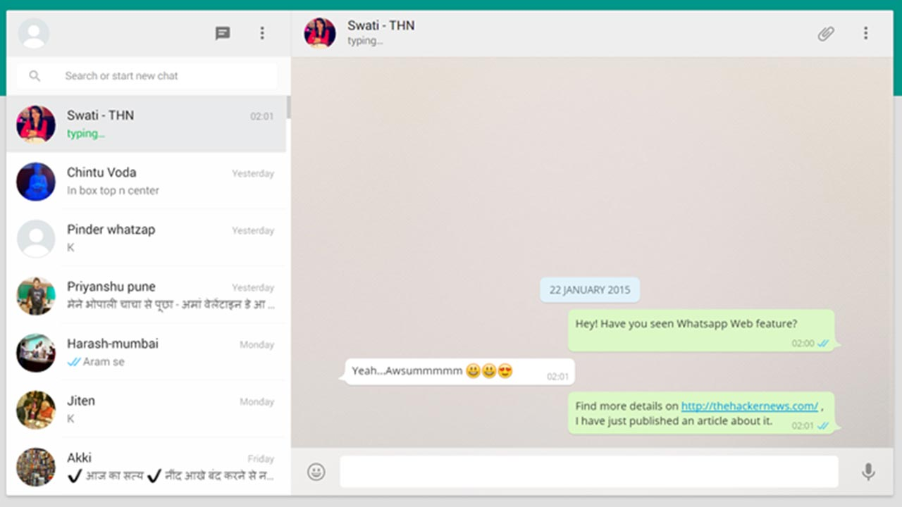
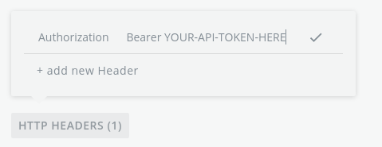

# Turn.io Chatty Code Challenge

Welcome to our front-end coding challenge!

## What you will build

Turn is built around chat, specifically around WhatsApp chats.

For this challenge, you will build a minimal chat web UI, think of something like [WhatsApp Web](https://web.whatsapp.com) (screenshot below).



## App requirements

We'd like to see a minimal application that interacts with the provided GraphQL API.

1. Show the list of chats in a sidebar

2. Once a chat is selected from the sidebar, the app should list the messages for that chat inside the main area

3. From the same main area, it should be possible to send a new message in the chat

4. New incoming chats/messages should show up in the app without needing to reload the page.

## Technical requirements

You are free to use any libraries you want for the challenge, but please make sure to follow the following technical requirements. Also consider using this starter React project (instructions in dedicated paragraph below) to accelerate times.

- The app should be built using the lastest version of React

- The app should preferably be coded in TypeScript, however we also accept submissions written in plain JavaScript

- The app should interact with the provided GraphQL API

- The codebase should be clean and easy to read (however we are conscious of the time constraints, so don't stress too much on this last point)

## The API you will use

We have built a GraphQL API for the challenge. Your app will connect to the GraphQL API to fetch the list of chats and messages and will use it to send new messages.

The API simulates real-world chats (not really, it's not that smart!) and constantly generates new incoming chats/messages.

To use the API, you will need an API token. Follow these steps to get an API token:

1. Visit https://chatty.gigalixirapp.com/
2. Click on _Register_ and create an account
3. Once logged in, you will find your API token shown in the UI

The token is valid for 60 days. You don't need to implement authentication in your app, you just need to hardcode the API token in the app in to be able to use the API.

### Explore the API

You can explore the GraphQL API schema using the GraphQL Playground hosted [here](https://chatty.gigalixirapp.com/graphql/graphiql).

Please remember that most API calls require authentication, so you would need to add an HTTP header to the Playground interface as shown in the picture:



## This React starter project

To facilitate the task, we have created this starter React project, which is already connected to the GraphQL API for the challenge using [Apollo React Client](https://www.apollographql.com/docs/react).

All you need to start this example project is the following:

1. Clone this repository on your computer

1. Follow the steps in the previous paragraph to create an account on the challenge website and obtain your API token

1. Add a `.env` file to the root of the project and add your API token to it using the following syntax:

   ```
   REACT_APP_API_TOKEN=your-api-token-here
   ```

1. Install dependencies with `npm install`

1. Run the development server with `npm run start`

You are free to use different libraries and start your React project in a different way, we hope the example code in this project will still be useful to you.

## Important: keep it minimal!

Please remember to keep it minimal and not spend too much time on the challenge.

Here are some tricks to keep the project small:

- Don't implement authentication, it's perfectly fine to hardcode you access token in the app (in fact, that's what we did in this starter project)

- Want to showcase your exceptional UI/design abilities? Just do it on a very small element and add a comment saying you would normally do the same for every element

- Want to show how you write tests? Just write a single, small one

- Take shortcuts, just add some comments explaining how you would do things normally if you had the time

- Want to showcase something that takes too long to build? Just describe it using comments in your code, you don't have to actually implement it

## API settings

In case you decide not to use this React starter project, these are the settings you might need to connect to the GraphQL API.

None of this is needed if you decide to use this starter project, as the Apollo client is already configured correctly.

```
HTTP endpoint: https://chatty.gigalixirapp.com/graphql
Web Socket endpoint: wss://chatty.gigalixirapp.com/graphql/ws
API Access token: (obtained manually, see instructions in dedicated paragraph)
```

To authenticate HTTP requests, you will need to add an Authorization HTTP header that holds the bearer token, somethink like:

```
Authorization Bearer YOUR-API-TOKEN-HERE
```

To connect to the websocket (if you intend to use GraphQL subscriptions) you need to provide an object like the following when initializing the connection:

```
{token: "YOUR-API-TOKEN-HERE"}
```

## Need help?

Please contact us by email at federico@turn.io in case of questions.
